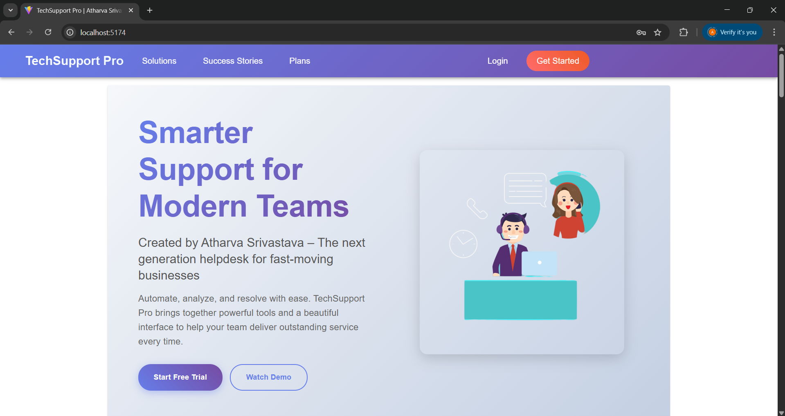
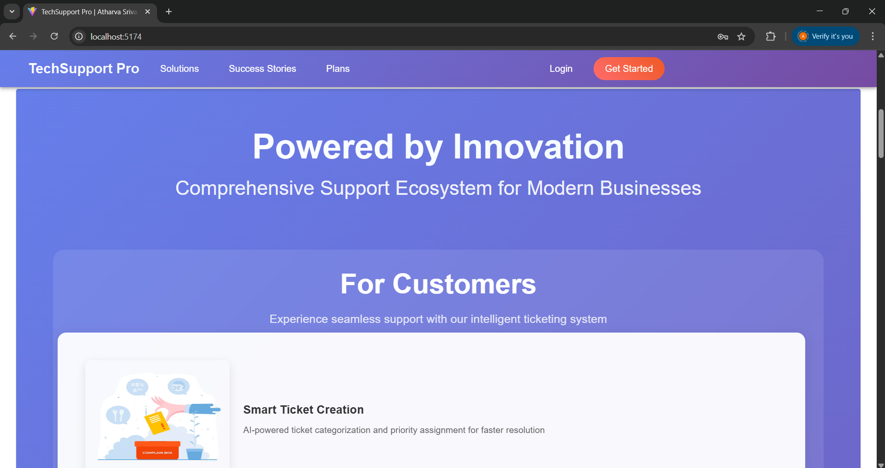
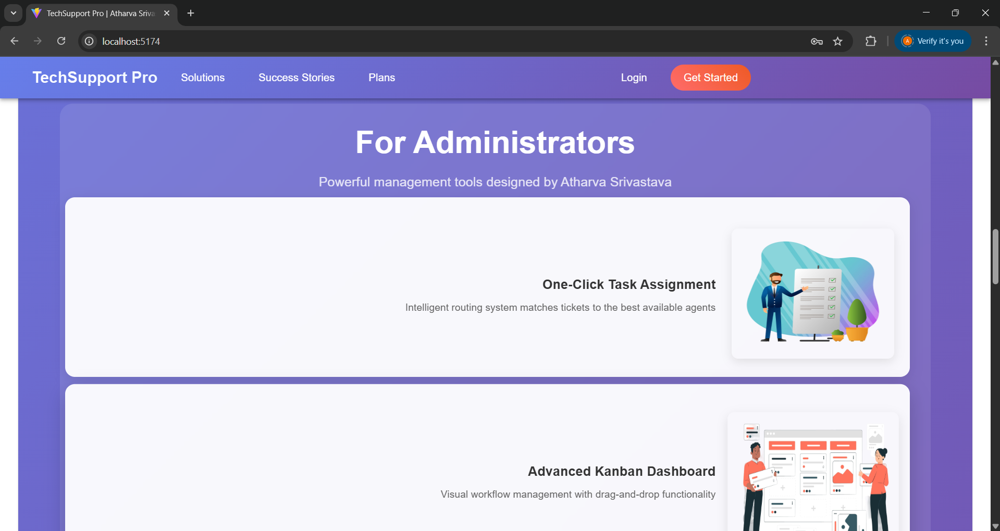
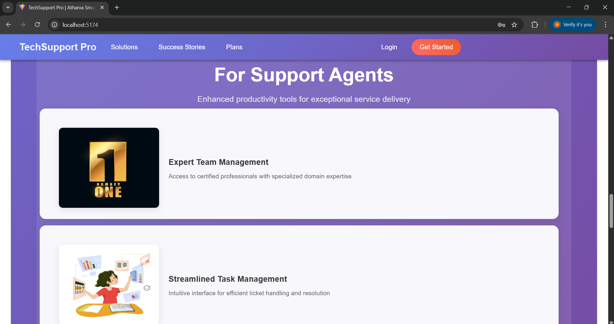
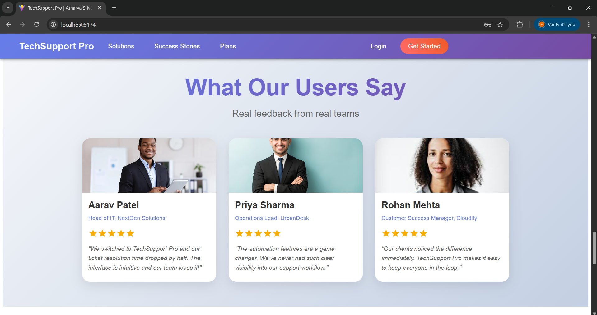
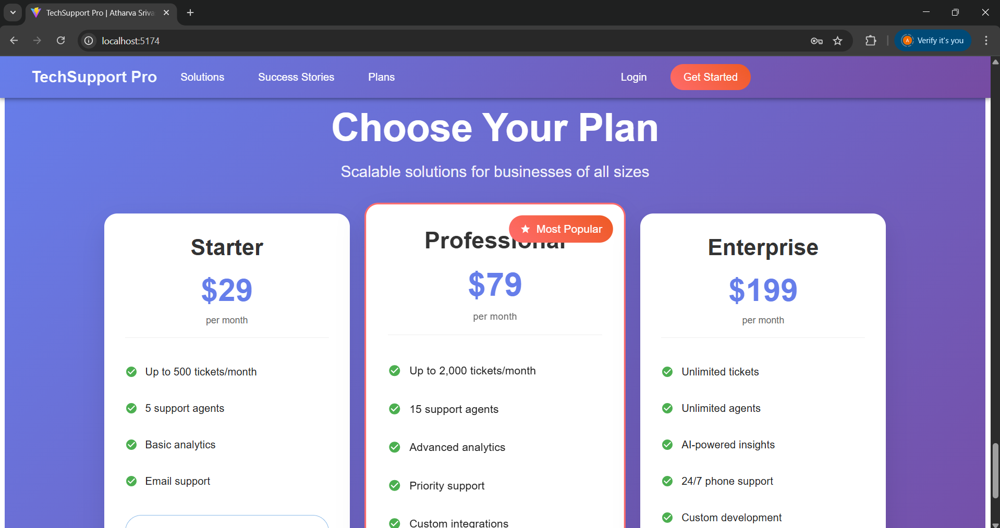
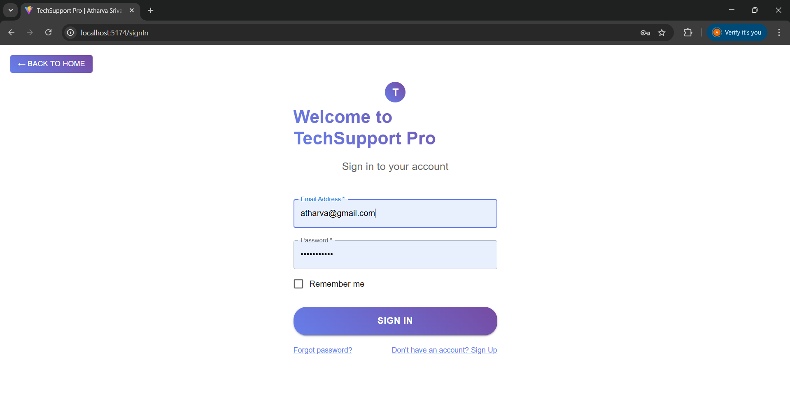
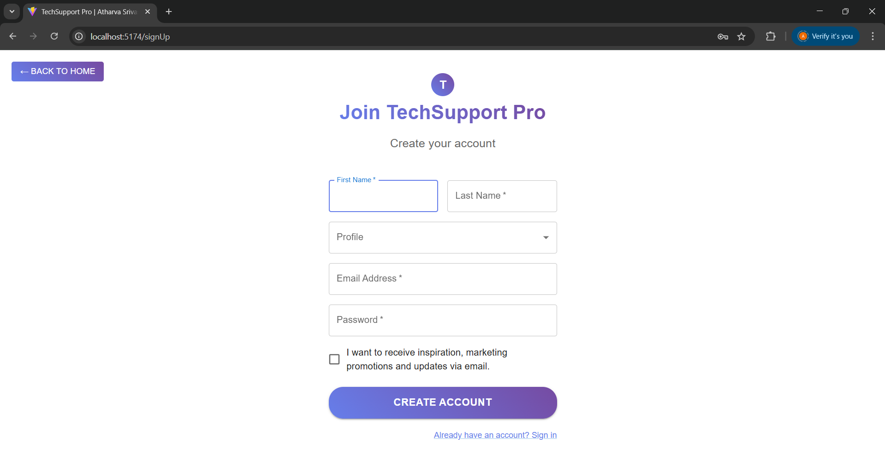
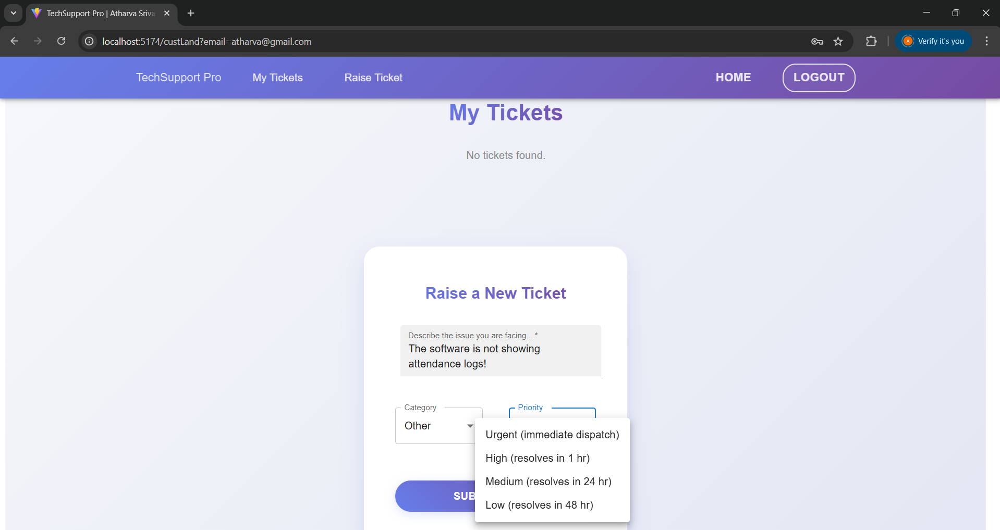
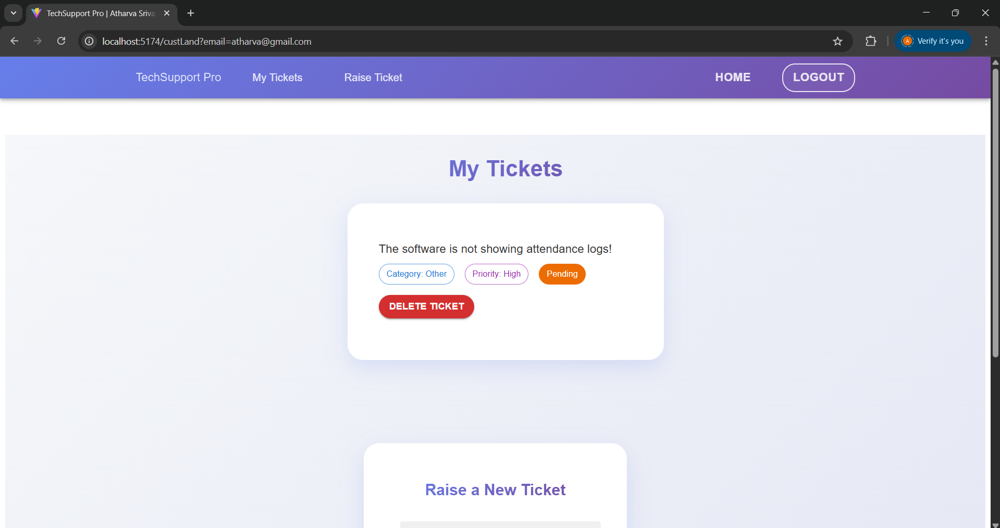

# 🚀 TechSupport Pro - Intelligent Service Desk Management System

**TechSupport Pro** is a next-gen **Support Ticketing Platform** designed and developed by **Atharva Srivastava**, built to transform how businesses manage customer service. With role-based access, smart ticket tracking, and responsive UI, it ensures seamless communication between customers, support agents, and admins.

---

## 🎯 Project Overview

TechSupport Pro empowers businesses with a robust support ecosystem. Powered by **React.js**, **Firebase**, and **Material UI**, it ensures fast ticket resolution, automated workflows, and role-specific dashboards. Whether you're a customer looking for help, an agent handling support, or an admin managing operations — TechSupport Pro simplifies everything.

---

## 🖼️ Interface Walkthrough

Below is a visual overview of the platform’s pages and their functionality:

| Page                  | Preview | Description |
|-----------------------|---------|-------------|
| **Hero Section** |  | Eye-catching homepage with a quick overview and navigation for different user roles. |
| **Customer Dashboard** |  | Customers can raise new tickets, monitor status, and view ticket history. |
| **Administrator Panel** |  | Admins can assign agents, monitor performance, and configure system settings. |
| **Support Agent Interface** |  | Agents manage and resolve tickets, update statuses, and respond to users. |
| **Testimonials Section** |  | Real feedback from satisfied customers and team members. |
| **Subscription Plans** |  | Users can explore pricing tiers and choose plans according to their needs. |
| **Sign In Page** |  | Secure login portal with email/password authentication. |
| **Create Account Page** |  | New users can register based on their role (Customer/Agent/Admin). |
| **Ticketing System** |  | Users can raise new tickets, view active ones, and track progress. |
| **Ticket Submission Confirmation** |  | Visual confirmation after successful ticket submission. |

---

## 🌟 Core Highlights

- 📊 **Live Dashboard Analytics** – Actionable metrics for admins and teams.
- 🧠 **Aided Workflows** – Smarter ticket routing and escalation logic.
- 🧑‍🤝‍🧑 **Role-Based Views** – Tailored interfaces for admins, agents, and customers.
- 📱 **Responsive & Fast** – Optimized for performance across all devices.
- 🔐 **Secure Login System** – Firebase-backed auth with real-time sync.

---

## 🛠️ Technology Stack

### 🔧 Frontend
- **React.js (v18+)** – Modular and reactive UI
- **Material UI (v5)** – Sleek, responsive components
- **React Router DOM** – Smooth in-app navigation
- **Vite** – Lightning-fast dev experience and builds

### 🔙 Backend & Hosting
- **Firebase Authentication** – Secure role-based login system
- **Firestore** – Real-time database and storage
- **Firebase Hosting** – Scalable, fast deployment

---

## 🚀 Getting Started

### ⚙️ Prerequisites
- Node.js (v18+)
- npm or yarn installed

### 🧩 Installation

```bash
git clone https://github.com/yourusername/techsupport-pro.git
cd techsupport-pro
npm install
npm run dev
````

Create a `.env` file and configure your Firebase credentials:

```env
VITE_FIREBASE_API_KEY=your_api_key
VITE_FIREBASE_PROJECT_ID=your_project_id
...
```

---

## 💼 Role-Based Functionalities

### 👨‍💻 Customer Interface

* Raise tickets with AI-assisted issue detection
* Get instant feedback and confirmation
* Monitor issue status in real time

### 🧑‍🔧 Support Agent Dashboard

* View and respond to assigned tickets
* Manage ticket status and history
* Collaborate using internal notes or templates

### 👨‍🏫 Admin Control Panel

* Assign roles and monitor performance
* Configure settings, track KPIs, and manage plans
* View system-wide ticket flow analytics

---

## 🎨 Design & UX Philosophy

TechSupport Pro is built on principles of clarity, efficiency, and scalability:

* ✨ **Clean Aesthetic** – Minimalist layout with clear visual hierarchy
* 🔁 **Responsive UX** – Adapts smoothly across screen sizes
* 🧩 **Component-Based Architecture** – Ensures consistency and reuse
* ♿ **Accessibility First** – Inclusive for all users

---

## 📈 Performance Impact

* ⚡ **50% faster resolution time** via smart routing
* 🎯 **Up to 90% customer satisfaction** from intuitive support
* 📊 **Real-time data sync** ensures zero-lag status updates
* 📈 **Team productivity boost** with automation and templates

---

## 🧪 Future Enhancements

* 🔔 Email & SMS Notifications
* 💬 Live Chat with Bot Hand-off
* 📦 Plan Billing & Invoicing
* 🔍 ElasticSearch Ticket Lookup
* 📊 Custom Analytics Reports

---

## 🤝 Contact & Support

**Developer:** Atharva Srivastava
📩 **Email:** [atharvasrivastavacoding@gmail.com](mailto:atharvasrivastavacoding@gmail.com)

---

## 🙏 Acknowledgments

* [Material-UI](https://mui.com/) – Beautiful React components
* [Firebase](https://firebase.google.com/) – Seamless backend services
* [React](https://reactjs.org/) – Powerful frontend library
* All the testers and users who helped shape the platform

---

> *Built with 💙 and clean code by Atharva Srivastava*

```
